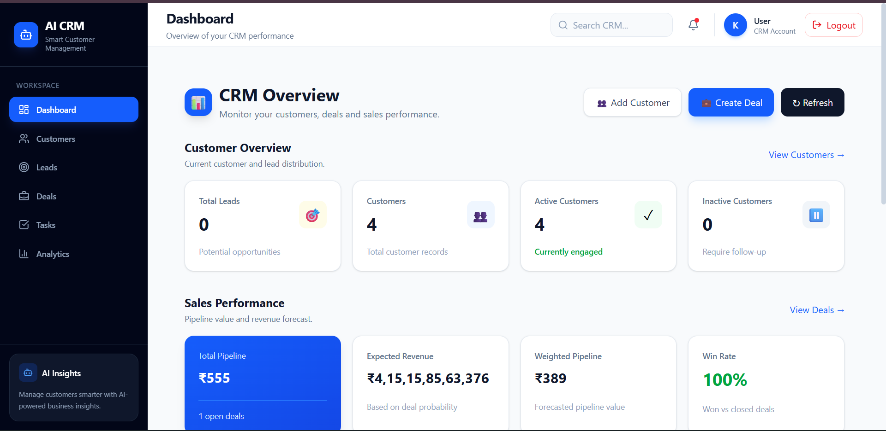

Today 9:13 PM
this is the screenshot of aicrm website i will provide some also wait for that after that u have to give me a professional readme and selected screenshot which i coppypaste on vs code and then commit on github

Absolutely. 👍

I have the screenshots and I’ll wait for any additional ones you want to provide.

Once you say “done”, I’ll prepare a professional, GitHub-ready README.md for the AI CRM, including:

Project overview
Key features
AI-powered functionality
Customer management
Lead management & lead scoring
Deal/pipeline management
Task management
Dashboard & analytics
Authentication
Forgot-password + OTP email flow
Tech stack
Architecture/project structure
API/backend overview
Environment variables
Local setup instructions
Deployment information
Screenshots section with the most relevant screenshots selected
Live demo
GitHub repository
Future enhancements
Professional project highlights

I'll also make the README copy-paste ready for VS Code, so you can simply replace your existing README.md, commit, and push it to GitHub.

Send the remaining screenshots whenever you're ready.

now give me back selected screenshots to upload on github

Yes — I selected the 8 most useful screenshots for your GitHub README. I intentionally removed the repetitive screenshots and kept the ones that best demonstrate the actual product.

Selected screenshots
Dashboard — overall CRM overview
Customers — customer directory
Leads — lead management
Deals — sales pipeline
Tasks — task management
Analytics — business/sales analytics
Login — authentication
Forgot Password — OTP password recovery
Download all selected screenshots

📦 Download AI CRM Selected Screenshots ZIP

Inside the ZIP:

screenshots/
├── 01-dashboard.png
├── 02-customers.png
├── 03-leads.png
├── 04-deals.png
├── 05-tasks.png
├── 06-analytics.png
├── 07-login.png
└── 08-forgot-password.png
For GitHub

In your project, create:

ai-crm/
├── client/
├── server/
├── screenshots/
│   ├── 01-dashboard.png
│   ├── 02-customers.png
│   ├── 03-leads.png
│   ├── 04-deals.png
│   ├── 05-tasks.png
│   ├── 06-analytics.png
│   ├── 07-login.png
│   └── 08-forgot-password.png
├── README.md
└── ...

Then your README can reference them cleanly with:

These are the screenshots I would use in the final professional README rather than uploading all 20 screenshots. They give a recruiter a quick view of the major functionality without making the README unnecessarily long. 

now give me long proffessional readme 

Done. I prepared a long, professional, GitHub-ready README specifically for your current AI CRM, based on the actual project structure/stack and the screenshots you provided.

📄 Download the complete README

Download README_AI_CRM_PROFESSIONAL.md

It includes:

Professional project introduction
Live demo + GitHub section
Complete feature breakdown
Authentication & JWT
OTP password recovery with Brevo
Customer management
Lead management
Deal/pipeline management
AI-powered CRM intelligence
Analytics & sales intelligence
Task management
Dashboard
System architecture diagram
Application flow
Project structure
API modules
Security
Brevo integration
Sales calculations
Recharts analytics
Local installation
Environment variables
Frontend/backend setup
API testing
Render deployment
UI/UX overview
Engineering highlights
Future enhancements
Project highlights
Author section
Professional screenshot gallery using the 8 selected screenshots
Your final GitHub structure should be
ai-crm/
│
├── client/
├── server/
│
├── screenshots/
│   ├── 01-dashboard.png
│   ├── 02-customers.png
│   ├── 03-leads.png
│   ├── 04-deals.png
│   ├── 05-tasks.png
│   ├── 06-analytics.png
│   ├── 07-login.png
│   └── 08-forgot-password.png
│
└── README.md
Then in VS Code

Replace your current README.md with the downloaded README content and make sure the screenshots folder is at the root of the repository, alongside client and server.

Then:

git add README.md screenshots
git commit -m "docs: add professional project README and screenshots"
git push origin main

One important detail: your current server/package.json still contains nodemailer, even though your production password-reset implementation now uses the Brevo API. The README correctly documents the current Brevo approach rather than presenting SMTP as the production email mechanism. 

README_AI_CRM_PROFESSIONAL.md
Document

README_AI_CRM_PROFESSIONAL.md
🚀 AI CRM — Intelligent Customer Relationship Management Platform

 <strong>A modern full-stack CRM for managing customers, leads, deals, tasks, analytics, and AI-powered sales intelligence.</strong> 

 <a href="https://ai-crm-1-azsh.onrender.com">Live Demo</a> • <a href="https://github.com/kritik-24/ai-crm">GitHub Repository</a> 

📌 Overview

AI CRM is a full-stack Customer Relationship Management platform built with the MERN stack and designed to centralize customer data, sales opportunities, follow-ups, tasks, and business analytics in one application.

The platform combines traditional CRM workflows with AI-powered insights and sales intelligence, allowing users to manage the complete customer lifecycle from a single dashboard.

The application includes secure authentication, protected REST APIs, MongoDB-based data persistence, customer and lead management, deal pipeline tracking, task management, business analytics, AI-assisted insights, and a production deployment on Render.

Project Type: Full-Stack Web Application / CRM / AI-Enhanced Business Application
Architecture: React + REST API + Node.js + MongoDB
Deployment: Render
Primary Focus: CRM workflows, sales pipeline management, analytics, authentication, and AI-assisted insights

🌐 Live Application
Frontend

AI CRM:
https://ai-crm-1-azsh.onrender.com

Backend API

API Server:
https://ai-crm-z8k9.onrender.com

Repository

GitHub:
https://github.com/kritik-24/ai-crm

✨ Key Features
🔐 Secure Authentication

The application provides a complete authentication workflow:

User registration
User login
JWT-based authentication
Protected application routes
Authentication middleware
Password reset workflow
OTP-based password recovery
Transactional email delivery through Brevo API
Secure password hashing using bcrypt
Password Recovery Flow
User selects "Forgot Password"
          ↓
Enters registered email
          ↓
Backend validates the user
          ↓
6-digit OTP generated
          ↓
OTP stored temporarily with expiry
          ↓
Brevo Transactional Email API
          ↓
OTP delivered to user's email
          ↓
User verifies OTP
          ↓
Password can be reset
👥 Customer Management

AI CRM provides a centralized customer directory for managing customer relationships.

Capabilities
Add new customers
Store customer name and email
Store phone information
Associate customers with companies
Maintain customer status
Add customer notes
Search customers
Filter customers by status
Edit customer records
Delete customer records
Request AI-powered customer insights
Customer Lifecycle
Lead
  ↓
Customer
  ↓
Active Relationship
  ↓
Deal / Opportunity
  ↓
Follow-up / Task
🎯 Lead Management

The Leads module is designed to manage potential customers and sales opportunities.

Features
Lead management dashboard
Lead statistics
Lead search
Priority filtering
Lead pipeline
Company association
Contact-readiness indicators
AI-powered lead scoring interface

The lead management workflow helps organize potential customers before they move further into the sales pipeline.

💼 Deal & Sales Pipeline Management

The Deals module provides a structured sales pipeline for tracking opportunities.

Deal stages
Stage	Description
Prospecting	Initial opportunity
Negotiation	Active discussion or negotiation
Won	Successfully converted deal
Lost	Opportunity that was not converted
Deal Features
Create deals
Track deal value
Associate deals with customers
Track sales stages
Search deals
Filter by stage
Edit deals
Delete deals
View pipeline statistics
AI risk analysis
Calculate pipeline value
Calculate weighted pipeline
Calculate expected revenue
Track win rate
🤖 AI-Powered CRM Intelligence

The application integrates the OpenAI API to provide AI-assisted CRM insights.

AI functionality is designed to add intelligence on top of existing CRM data rather than replacing the core CRM workflow.

AI-enabled areas
Customer insights
Lead scoring
Deal risk analysis
Sales intelligence
Business insights
Example workflow
CRM Data
   │
   ├── Customer Information
   ├── Lead Information
   ├── Deal Information
   └── Sales Pipeline
            │
            ▼
       AI Analysis
            │
            ▼
     Actionable Insight
📊 Analytics & Sales Intelligence

The Analytics module provides a business-level view of CRM performance.

Analytics include
Total customers
Active customers
Total deals
Pipeline value
Expected revenue
Weighted pipeline
Win rate
Deal distribution by stage
Customer health
Task performance
High-risk deals
Won revenue
Lost revenue
Sales Intelligence

The application also provides a dedicated sales intelligence section for highlighting key business outcomes.

Sales Intelligence
        │
        ├── Won Revenue
        ├── Lost Revenue
        └── High Risk Deals
✅ Task Management

The Tasks module helps users manage CRM-related work and follow-ups.

Features
Create tasks
Set task title
Set due date
Associate task with a customer
Associate task with a deal
Set priority
Set status
Add task description
Search tasks
Filter by status
Filter by priority
Track task completion
Task workflow
Create Task
     ↓
Assign Customer / Deal
     ↓
Set Priority
     ↓
Set Due Date
     ↓
Track Status
     ↓
Complete Task
📈 Dashboard

The main dashboard provides a high-level overview of CRM performance.

Dashboard metrics
Total leads
Total customers
Active customers
Inactive customers
Total pipeline
Expected revenue
Weighted pipeline
Win rate
Pipeline by stage

The dashboard also provides quick actions for:

Adding customers
Creating deals
Refreshing CRM data
Viewing customers
Viewing deals
🖥️ Screenshots
Dashboard

The dashboard provides a centralized overview of customers, leads, deals, pipeline value, expected revenue, and win rate.

Customer Management

The customer directory provides customer search, status filtering, editing, AI insights, and deletion functionality.

Lead Management

The Leads module provides lead statistics, search, priority filtering, pipeline tracking, and AI-powered lead intelligence.

Deal Pipeline

The Deals module provides pipeline tracking, deal stages, deal values, search, filtering, editing, deletion, and AI risk analysis.

Task Management

The Tasks module provides task creation, due dates, priorities, statuses, customer/deal associations, and task tracking.

Analytics

The Analytics dashboard visualizes customer health, sales pipeline, deal distribution, business health, task performance, and sales intelligence.

Authentication

Secure authentication provides the entry point to the CRM application.

Password Recovery

The password recovery interface allows users to request an OTP through their registered email address.

🛠️ Technology Stack
Frontend
Technology	Purpose
React 19	User interface
React Router	Client-side routing
Axios	API communication
Tailwind CSS	UI styling
Recharts	Analytics visualization
Lucide React	Interface icons
Vite	Frontend build tooling
Backend
Technology	Purpose
Node.js	Runtime environment
Express.js	REST API framework
Mongoose	MongoDB ODM
JWT	Authentication
bcryptjs	Password hashing
CORS	Cross-origin API access
dotenv	Environment configuration
OpenAI API	AI-powered insights
Brevo API	Transactional email delivery
Database
MongoDB
Mongoose
Deployment
Render
GitHub
Development Tools
Git
GitHub
Postman
VS Code
🏗️ System Architecture
                         ┌──────────────────────┐
                         │        USER          │
                         └──────────┬───────────┘
                                    │
                                    ▼
                         ┌──────────────────────┐
                         │   React Frontend     │
                         │      Vite            │
                         │  Tailwind / Axios    │
                         └──────────┬───────────┘
                                    │
                              REST API + JWT
                                    │
                                    ▼
                         ┌──────────────────────┐
                         │   Express.js API     │
                         │      Node.js         │
                         └──────────┬───────────┘
                                    │
                  ┌─────────────────┼─────────────────┐
                  │                 │                 │
                  ▼                 ▼                 ▼
          ┌──────────────┐  ┌──────────────┐  ┌──────────────┐
          │   MongoDB    │  │  OpenAI API  │  │  Brevo API   │
          │   Database   │  │ AI Insights  │  │ Email / OTP  │
          └──────────────┘  └──────────────┘  └──────────────┘
🔄 Application Architecture Flow
React UI
   │
   ▼
Axios API Request
   │
   ▼
Express.js REST API
   │
   ▼
Authentication / JWT Middleware
   │
   ▼
Controller Layer
   │
   ▼
Business Logic
   │
   ├──────────────► MongoDB
   │
   ├──────────────► OpenAI API
   │
   └──────────────► Brevo API
   │
   ▼
JSON Response
   │
   ▼
React UI Update
📁 Project Structure
ai-crm/
│
├── client/
│   │
│   ├── src/
│   │   ├── api/
│   │   ├── components/
│   │   ├── pages/
│   │   ├── context/
│   │   └── ...
│   │
│   ├── public/
│   ├── package.json
│   └── vite.config.js
│
├── server/
│   │
│   ├── controllers/
│   ├── models/
│   ├── routes/
│   ├── middleware/
│   ├── utils/
│   ├── db.js
│   ├── server.js
│   └── package.json
│
├── screenshots/
│   ├── 01-dashboard.png
│   ├── 02-customers.png
│   ├── 03-leads.png
│   ├── 04-deals.png
│   ├── 05-tasks.png
│   ├── 06-analytics.png
│   ├── 07-login.png
│   └── 08-forgot-password.png
│
└── README.md
🔌 API Modules

The backend is organized around RESTful API modules.

Module	Responsibility
/api/auth	Registration, login, password recovery
/api/customers	Customer management
/api/deals	Deal and pipeline management
/api/tasks	Task management
/api/ai	AI-powered CRM insights

The API uses JSON requests and responses and protects authenticated resources using JWT-based authorization.

🔒 Authentication & Security

Security is an important part of the application architecture.

Authentication
Registration
    ↓
Password Hashing
    ↓
User Stored in MongoDB
    ↓
Login
    ↓
Credential Validation
    ↓
JWT Token
    ↓
Protected API Requests
Password security

Passwords are hashed using bcryptjs before storage.

Protected resources

Authenticated API requests use JWT-based authorization.

Password reset

The password reset workflow uses:

Registered email verification
Secure OTP generation
Temporary OTP expiration
Transactional email delivery
Password reset flow
📧 Transactional Email with Brevo

The application uses the Brevo transactional email API for password-reset OTP delivery.

The email workflow avoids dependency on traditional SMTP connections in the production deployment.

Forgot Password
       ↓
Generate OTP
       ↓
Store OTP + Expiration
       ↓
Brevo HTTPS API
       ↓
Transactional Email
       ↓
User Receives OTP

The Brevo API key and sender configuration are stored as environment variables and are not committed to GitHub.

🧮 Sales Intelligence Calculations

The CRM dashboard exposes several sales metrics.

Pipeline Value

The total value of deals currently represented in the sales pipeline.

Weighted Pipeline

Deal value adjusted according to the probability associated with the relevant sales stage.

Conceptually:

Weighted Pipeline
=
Σ (Deal Value × Stage Probability)
Expected Revenue

Revenue forecast derived from deal information and stage probabilities.

Win Rate

The dashboard provides a win-rate metric based on won and closed deal information available to the application.

📊 Analytics Visualizations

The analytics module uses Recharts to present CRM data visually.

Examples include:

Customer health distribution
Pipeline value by stage
Sales pipeline distribution
Task performance
Pipeline performance
Business health metrics

This transforms raw CRM records into a more readable business-performance view.

🚀 Getting Started
1. Clone the repository
git clone https://github.com/kritik-24/ai-crm.git
cd ai-crm
2. Install frontend dependencies
cd client
npm install
3. Install backend dependencies

Open another terminal:

cd server
npm install
⚙️ Environment Variables

Create a .env file inside the server directory.

Example:

PORT=5000

MONGO_URI=your_mongodb_connection_string

JWT_SECRET=your_jwt_secret

OPENAI_API_KEY=your_openai_api_key

BREVO_API_KEY=your_brevo_api_key
BREVO_SENDER_EMAIL=your_verified_sender_email
BREVO_SENDER_NAME=AI CRM

Important: Never commit .env files, API keys, JWT secrets, MongoDB credentials, or other sensitive credentials to GitHub.

▶️ Running the Application Locally
Start the backend
cd server
npm run dev

The backend will run on the configured port, typically:

http://localhost:5000
Start the frontend

Open another terminal:

cd client
npm run dev

Vite will provide the local frontend URL, typically:

http://localhost:5173
🧪 API Testing

The backend REST APIs can be tested using tools such as Postman.

A typical authentication test flow is:

POST /api/auth/register
          ↓
POST /api/auth/login
          ↓
Receive JWT
          ↓
Add Authorization Header
          ↓
Access Protected Endpoints

For password recovery:

POST /api/auth/forgot-password
          ↓
OTP generated
          ↓
Brevo email delivery
          ↓
OTP verification
          ↓
Password reset
🌍 Production Deployment

The project is deployed using Render.

Frontend

The React/Vite frontend is deployed as a static site.

Build process:

npm install
npm run build

The generated production files are served from:

client/dist
Backend

The Node.js backend is deployed as a web service.

Start command:

node server.js
Production architecture
                Internet
                   │
        ┌──────────┴──────────┐
        │                     │
        ▼                     ▼
 React Frontend          Express Backend
   Render                  Render
        │                     │
        └──────────┬──────────┘
                   │
                   ▼
                MongoDB
                   │
          ┌────────┴────────┐
          ▼                 ▼
      OpenAI API         Brevo API
📱 Responsive & Modern UI

The application follows a modern dashboard-oriented design with:

Sidebar navigation
Top navigation bar
Dashboard cards
Data tables and lists
Search controls
Filtering controls
Status indicators
Responsive forms
Sales pipeline cards
Analytics charts
AI insight actions
Clear action buttons
Consistent visual hierarchy

The UI is designed around a business application workflow rather than a simple CRUD interface.

🧠 Engineering Highlights

This project demonstrates practical full-stack development concepts including:

Frontend Engineering
Component-based React development
Client-side routing
API integration
Form handling
Protected routes
Dashboard UI development
Data visualization
State-driven UI updates
Backend Engineering
REST API design
Express.js middleware
Controller-based architecture
MongoDB data modeling
Authentication middleware
JWT authorization
Password hashing
Error handling
External API integrations
Database
MongoDB
Mongoose models
CRUD operations
Relationships between CRM entities
External Services
OpenAI API
Brevo transactional email API
MongoDB
Render deployment
📋 CRM Modules at a Glance
Module	Main Capabilities
Authentication	Register, login, JWT, password reset
Dashboard	CRM overview and KPIs
Customers	Customer records and AI insights
Leads	Lead tracking and scoring
Deals	Pipeline and deal management
Tasks	Follow-ups and task tracking
Analytics	Business and sales analytics
AI Insights	AI-assisted CRM analysis
🔮 Future Enhancements

Potential future improvements include:

Role-based access control
Multi-user teams
Team member assignment
Advanced lead scoring
More sophisticated AI recommendations
Automated follow-up generation
Email campaign management
Customer activity timeline
Calendar integration
Real-time notifications
Advanced sales forecasting
Custom reports
Export to CSV/PDF
Advanced filtering
Audit logs
Dark mode
Mobile-focused UI improvements
Automated CRM workflows
Sales activity reminders
More advanced AI-driven recommendations
🎯 What This Project Demonstrates

AI CRM demonstrates the ability to build and deploy a complete production-style full-stack application rather than an isolated frontend project.

The project covers:

Frontend Development
        +
REST API Development
        +
Database Design
        +
Authentication
        +
External API Integration
        +
AI Integration
        +
Analytics
        +
Email Automation
        +
Cloud Deployment

This makes the project representative of a real-world business application architecture.

📸 Product Walkthrough

The primary application workflow can be summarized as:

Login
  ↓
Dashboard
  ↓
Customers / Leads
  ↓
Create Deal
  ↓
Track Pipeline
  ↓
Create Follow-up Tasks
  ↓
Review Analytics
  ↓
Use AI Insights
🏆 Project Highlights
Full-stack MERN CRM application
Modern React-based dashboard
RESTful Node.js/Express backend
MongoDB database integration
JWT authentication
Password hashing with bcrypt
OTP-based password recovery
Brevo transactional email integration
OpenAI API integration
Customer management
Lead management
Deal pipeline management
Task management
Business analytics
Sales intelligence
Deal risk analysis
Pipeline forecasting
Recharts-based visualizations
Production deployment using Render
Git/GitHub version control
👨‍💻 Author
Kritik Pratap Singh

Full Stack Developer | MERN Stack Developer

Interested in building scalable web applications, backend systems, AI-integrated products, and data-driven software solutions.

Connect
GitHub: https://github.com/kritik-24
⭐ Support

If you find this project useful or interesting, consider giving the repository a ⭐ on GitHub.

📄 License

This project is developed for learning, portfolio, and demonstration purposes.

 <strong>AI CRM — Smart Customer Management</strong> 
